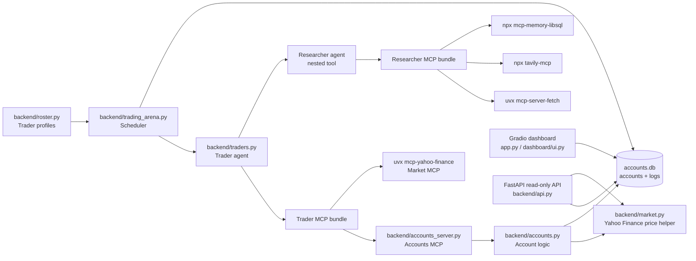
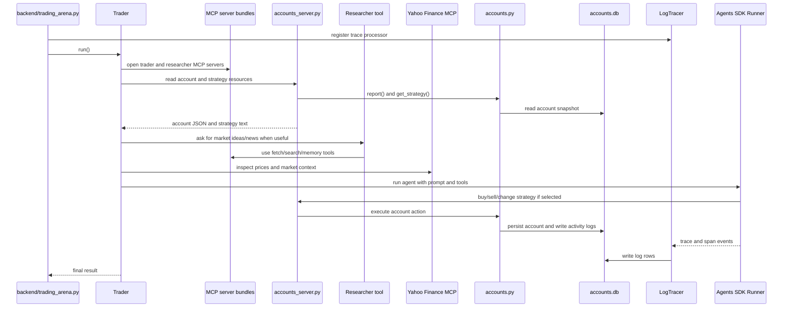

# Architecture

Trading Arena is an autonomous trading simulation where several AI traders
manage separate accounts, research market opportunities, buy and sell shares,
and compete on a shared leaderboard.

The project is intentionally local-first:

- account state and activity logs are stored in local SQLite at `accounts.db`
- the dashboard runs as a local Gradio app
- the API is a local read-only FastAPI service
- MCP servers are started as local stdio subprocesses when agents run

## Components

### Scheduler

`backend/trading_arena.py` owns the long-running scheduler. It reads trader
profiles from `backend/roster.py`, creates one `backend.traders.Trader` runtime
per profile, and runs traders every `RUN_EVERY_N_MINUTES` when the configured
time window is open.

The scheduler also registers `LogTracer`, which converts Agents SDK trace/span
events into rows in the `logs` table in `accounts.db`.

### Trader Profiles

`backend/roster.py` defines the participants. Each `TraderProfile` contains:

- `name`
- `lastname`
- `strategy`
- `model_name`

The roster decides who participates. It does not define a fixed stock universe.

### Trader Agent

`backend/traders.py` defines the default autonomous trader runtime. On each run,
the trader:

- opens trader MCP servers
- opens researcher MCP servers
- creates a nested researcher tool
- reads account and strategy resources
- builds either a trading prompt or a rebalancing prompt
- runs the Agents SDK `Runner`
- toggles between trade and rebalance mode for the next cycle

### Researcher Agent

The default researcher is also built in `backend/traders.py`. It is exposed to
the trader as a nested tool. The researcher has its own MCP servers for fetch,
web search, and memory.

### Accounts Backend

`backend/accounts.py` owns account behavior:

- cash balance
- holdings
- transactions
- portfolio valuation
- profit/loss
- buy/sell guardrails
- strategy text

Account methods persist snapshots through `backend/database.py`.

### MCP Servers

MCP server bundles are defined in `backend/mcp_servers.py`.

Trader-facing servers include:

- accounts MCP server: account reads and account actions
- Yahoo Finance MCP server: market-data tools for decision support

Researcher-facing servers include:

- fetch
- Tavily web search
- memory

See [mcp_servers.md](mcp_servers.md) for the full wiring.

### Dashboard

The dashboard is a local Gradio app launched from `app.py` and implemented in
`dashboard/ui.py`. It reads account state and logs, then renders the leaderboard,
holdings, transactions, and recent activity for each trader.

### API

`backend/api.py` exposes a read-only FastAPI API for dashboard-friendly account
and market status queries.

### Persistence

`backend/database.py` stores:

- account snapshots in the `accounts` table
- activity and trace logs in the `logs` table

The SQLite file is created at runtime as `accounts.db`.

Researcher memory is stored separately through the memory MCP server under
`memory/`. Each trader gets a separate memory database based on first and last
name, such as `memory/sanjay_negi.db` or `memory/neil_sharma.db`. The researcher
uses this memory for company notes, sector notes, source notes, and prior
research findings; account state remains in `accounts.db`.

## High-Level Diagram



## One Trader Cycle



## Ticker Selection

There is no hardcoded tradable ticker list in the current implementation. The
flow is:

```text
Trader prompt says: look for opportunities
  -> Trader may ask Researcher for market ideas/news
  -> Trader may use Yahoo Finance MCP tools
  -> LLM chooses a ticker
  -> Account tool tries to buy/sell that ticker
```

The account tool accepts the chosen symbol, normalizes it, and calls
`backend.market.get_share_price(symbol)`. If Yahoo Finance returns a usable
positive price and account guardrails pass, the trade can execute. If not, the
operation fails with `ValueError`.

## Research Flow

Research is handled by the nested Researcher agent, not by a fixed Python
pipeline. The code gives the Researcher instructions and MCP tools; the LLM
chooses when to search, fetch, remember, and summarize.

```text
Trader asks Researcher for ideas/news/context
  -> Researcher uses Tavily search for discovery
  -> Researcher uses Fetch when it has a specific URL to inspect
  -> Researcher may use Memory to recall or store useful notes
  -> Researcher returns tickers, evidence, risks, and relevance
  -> Trader decides whether to use market/account tools
```

Tavily search is for discovery. Fetch is for reading a known source URL. Memory
is for carrying useful research context across future trader cycles.

## Trace And Log Flow

Trace and activity visibility follows this path:

```text
Trader run
  -> Agents SDK trace/span events
  -> backend.tracers.LogTracer
  -> backend.database.write_log(...)
  -> accounts.db logs table
  -> Dashboard Recent Logs / API logs endpoint
```

You can inspect logs through:

- dashboard: `http://127.0.0.1:7860`
- API: `GET /api/traders/{name}/logs`
- database: `accounts.db`, table `logs`
