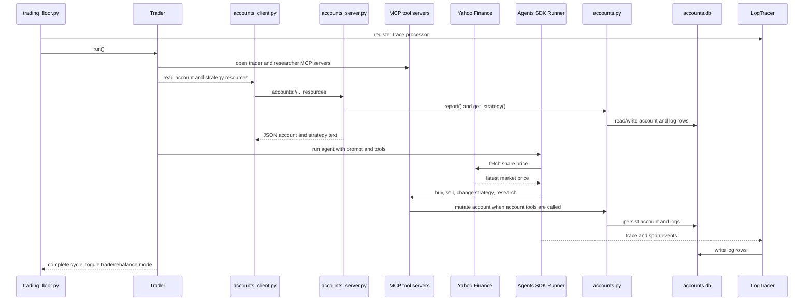

# Sequence Diagram

```mermaid
sequenceDiagram
    participant Floor as trading_floor.py
    participant Trader as Trader
    participant AccountsClient as accounts_client.py
    participant AccountsMCP as accounts_server.py
    participant Tools as MCP tool servers
    participant Yahoo as Yahoo Finance
    participant Runner as Agents SDK Runner
    participant Account as accounts.py
    participant DB as accounts.db
    participant Logs as LogTracer

    Floor->>Logs: register trace processor
    Floor->>Trader: run()
    Trader->>Tools: open trader and researcher MCP servers
    Trader->>AccountsClient: read account and strategy resources
    AccountsClient->>AccountsMCP: accounts://... resources
    AccountsMCP->>Account: report() and get_strategy()
    Account->>DB: read/write account and log rows
    AccountsMCP-->>AccountsClient: JSON account and strategy text

    Trader->>Runner: run agent with prompt and tools
    Runner->>Yahoo: fetch share price
    Yahoo-->>Runner: latest market price
    Runner->>Tools: buy, sell, change strategy, research
    Tools->>Account: mutate account when account tools are called
    Account->>DB: persist account and logs

    Runner-->>Logs: trace and span events
    Logs->>DB: write log rows
    Trader-->>Floor: complete cycle, toggle trade/rebalance mode
```
