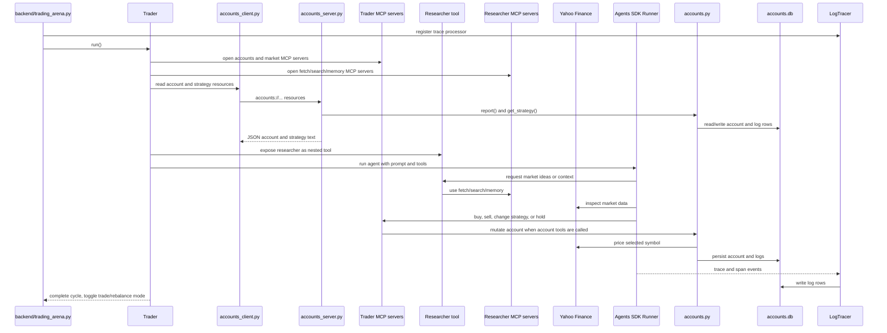

# Design Diagrams

This page keeps the compact design sequence diagram. For the fuller component
overview, architecture diagram, one-cycle flow, ticker selection flow, and
trace/log flow, see [architecture.md](architecture.md).

## Trader Cycle Sequence

