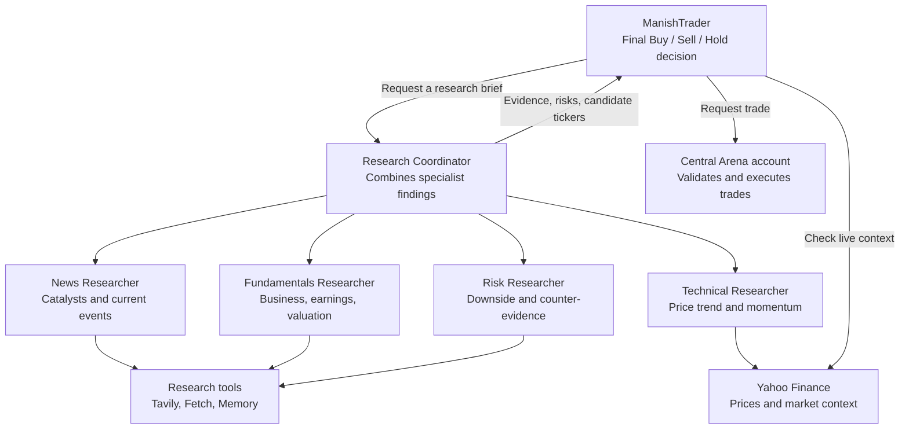

# Manish Kumar: Multi-Researcher Trading Workflow

## Goal

Build a personal `ManishTrader` that asks several specialist Researchers for a
concise research brief before deciding to buy, sell, or hold. Trading Arena
continues to own accounts, trade validation, persistence, logs, and the
dashboard.



## Responsibilities

| Component | Responsibility | Does not do |
| --- | --- | --- |
| `ManishTrader` | Requests research, checks account/market context, makes the final buy/sell/hold decision | Directly change account data or bypass trade rules |
| Research Coordinator | Assigns work to specialists and returns one concise, structured brief | Execute trades |
| News Researcher | Finds recent company, sector, and macro catalysts | Make the final investment decision |
| Fundamentals Researcher | Assesses business quality, earnings, valuation, and financial risks | Execute trades |
| Technical Researcher | Checks price trend, momentum, and relevant market context | Treat technical data as a guarantee |
| Risk Researcher | Looks for counter-evidence, concentration, downside triggers, and reasons not to trade | Execute trades |
| Central Trading Arena | Checks cash/holdings, executes valid trades, saves data, logs activity, and powers the dashboard | Decide Manish's investment philosophy |

## Research Brief Contract

The Coordinator should return a short brief with these fields:

```text
Candidate ticker(s)
Recommendation: BUY / SELL / HOLD / WATCH
Thesis: why it fits Manish's strategy
Supporting evidence: 2-4 concrete findings
Risks and counter-evidence
Technical/price context
Suggested invalidation condition
Confidence: low / medium / high
Sources or search terms used
```

The Trader treats this as decision support, not an automatic trade order. It
must still check account cash/holdings and live market information before using
the central account tools.

## Proposed Files

```text
backend/
├── researchers/
│   ├── __init__.py
│   └── manish_research_team.py      # Specialists and Coordinator tool
├── manish_trader.py                 # Manish's custom Trader runtime
├── templates.py                     # Add role-specific instructions
├── mcp_servers.py                   # Only if specialist tool bundles differ
└── trading_arena.py                 # Select ManishTrader for Manish's profile
```

Do not change `accounts.py`, `accounts_server.py`, `database.py`, `api.py`, or
the dashboard for this workflow. They remain centralized Arena services.

## Implementation Plan

### Phase 1 — Specialist design

Define the four specialist prompts and the exact research brief fields. Start
with the existing Tavily, Fetch, Memory, and Yahoo Finance tools; do not add new
data providers yet.

**Checkpoint:** review the responsibilities and brief format before writing the
agents.

### Phase 2 — Research team tool

Create `backend/researchers/manish_research_team.py`. It should build the
specialist agents and expose one trader-facing Coordinator tool. The internal
workflow can run specialists sequentially at first for easier debugging.

**Checkpoint:** test that the Coordinator returns a brief without placing a
trade.

### Phase 3 — Custom Trader

Create `backend/manish_trader.py`, extending `backend.interfaces.trader.Trader`.
Reuse the default Trader's safe lifecycle: open MCP servers, read the account,
create an agent, run with a turn limit, trace the run, and toggle trade versus
rebalance cycles. Replace the default single Researcher tool with the Research
Coordinator tool.

**Checkpoint:** run one ManishTrader cycle in a test mode and verify that no
trade occurs unless the agent explicitly requests one through the account MCP
server.

### Phase 4 — Scheduler selection

Update the factory in `backend/trading_arena.py` so only Manish's profile uses
`ManishTrader`; other participants continue to use the default `Trader`.

**Checkpoint:** verify the scheduler creates the correct class for every
profile.

### Phase 5 — Verification and rollout

Add deterministic tests for the research-brief format and Trader selection.
Run unit tests, `git diff --check`, reset accounts, and perform one supervised
cycle before enabling the normal scheduler interval.

## Tool Boundaries

- Start by giving all specialists the existing research bundle. Add different
  MCP server factories only when a specialist genuinely needs a different data
  source.
- Keep Manish's memory database isolated under `memory/manish_kumar.db`.
- The Trader alone receives account buy/sell tools. Researchers receive research
  tools only and must never execute trades.
- Maintain the existing account guardrails: insufficient cash and insufficient
  holdings must always cause the central account action to fail safely.

## Acceptance Criteria

- ManishTrader can request one research brief covering news, fundamentals,
  technical context, and risk.
- The brief includes ticker candidates, evidence, counter-evidence, and a clear
  recommendation.
- Only Manish uses the new workflow.
- Every trade still goes through the central accounts MCP server.
- Existing traders, dashboard views, account history, and scheduler behavior
  remain functional.
